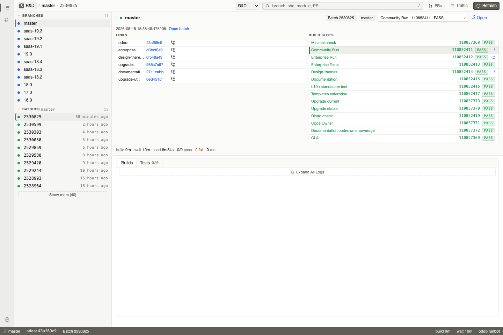

# runbot-next

Fast local console for public Odoo Runbot pages.

Runbot Next gives you a focused UI for branches, batches, builds, logs, and test failures without asking the browser to scrape Runbot directly. The local server fetches Runbot HTML, parses it, and serves the app plus API from one port.



## Run

```sh
npx runbot-next
```

or:

```sh
bunx runbot-next
```

The server starts on `http://127.0.0.1:3000`. If the port is busy, it tries the next available port, up to 100 ports.

Use `PORT` to choose the starting port:

```sh
PORT=5173 npx runbot-next
```

## Features

- Browse Runbot projects, branches, and batches.
- Open build slots, commits, logs, and run links quickly.
- Parse visible test failures from Runbot logs.
- Record proxied Runbot traffic while debugging.
- Runs locally through `npx` or `bunx`.

## Develop

```sh
bun install
bun run dev
PORT=3001 bun run serve
```

For production-package checks:

```sh
bun run build
bun run build:server
npm pack --dry-run
```

## CLI

The reusable tool definitions live in `src/runbot/tools.ts`.

```sh
bun run src/cli.ts projects
bun run src/cli.ts batches /runbot/rd-1 --search master
bun run src/cli.ts batch 2526059 --json
bun run src/cli.ts build 110606813
bun run src/cli.ts tests --batch 2413720 --slot "Enterprise Tests" --unparsed
```

## Note

Runbot public pages are server-rendered HTML. This app intentionally uses a local server because Runbot does not expose permissive browser CORS headers for direct client-side scraping.
